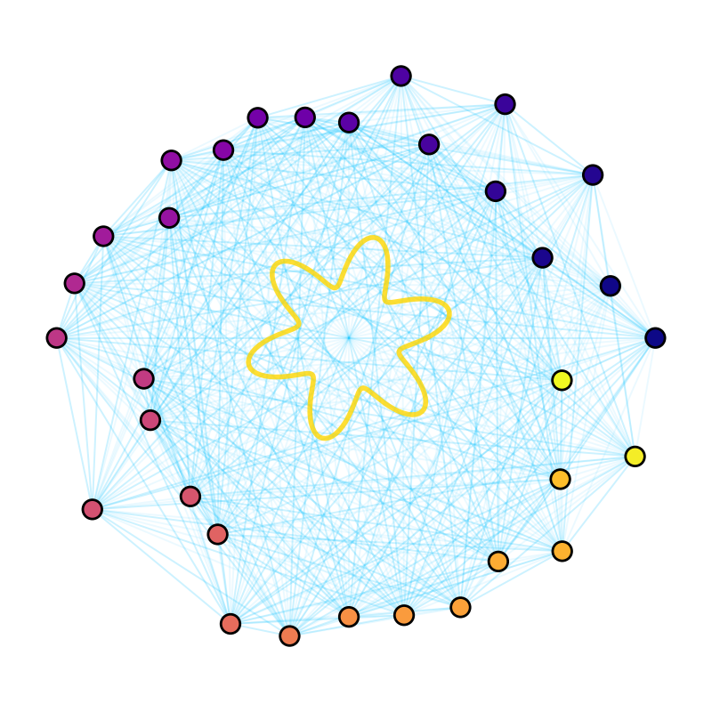

<p align="center">
  
</p>

<p align="center">
  <a href="https://github.com/sethuiyer/prime-annealer/actions"></a>
  <a href="https://github.com/sethuiyer/prime-annealer/blob/main/LICENSE"></a>
  <a href="https://www.python.org/"></a>
  <a href="https://pypi.org/project/numpy/"></a>
  <a href="https://github.com/sethuiyer/prime-annealer/blob/main/CITATION.cff"></a>
</p>


# Prime Annealer: Heat-Kernel Partitioning Playground

**Prime Annealer** is a research toolkit for exploring heat-kernel spectral partitioning on SAT-style clause sets, social networks, and other combinatorial workloads. It combines:
- Fast Python utilities for CNF workflows, surrogate training, and experiment automation
- A Crystal engine for low-latency annealing and neural surrogate demos

The project is designed for researchers, engineers, and enthusiasts interested in spectral graph theory, combinatorial optimization, and interpretable partitioning using prime-derived weights.

---

## Quickstart

### 1. Install Python dependencies

```bash
pip install numpy torch  # torch is optional, only for surrogate training
```

### 2. Install Crystal (for annealer and surrogate demos)

Crystal ≥ 1.8 is required. See [Crystal installation guide](https://crystal-lang.org/install/).

### 3. Run a demo (social network segmentation)

```bash
CRYSTAL_CACHE_DIR=./.crystal_cache crystal run multiplicative_constraint/examples/social_network.cr
```

### Running Python tools after a src/ layout change

If you move Python modules into `src/` (recommended for packaging), run scripts with `PYTHONPATH=./src` so imports like `from heat_kernel_partition import ...` continue to work without editing files. Example:

```bash
PYTHONPATH=./src python3 src/run_experiments.py
```

---

## Theoretical Backings

### 10 Core Aspects of the Prime Necklace Theory

1. **Prime Necklace Problem**  
  Arrange primes as beads on a circle and seek perfectly fair divisions—each participant receives an equal share of every prime "color." This deceptively simple puzzle is a gateway to deep mathematics and physics.
2. **Topology Guarantees Fairness**  
  The Borsuk-Ulam theorem from topology ensures that, for regular colored beads, a perfectly fair division always exists. However, the chaotic distribution of primes complicates this guarantee in practice.
3. **Modular Rhythm Engineering**  
  The breakthrough is to ignore prime values and focus on their indices in the sequence. By mapping indices cyclically (modulo the number of groups), perfect modular fairness is achieved, smoothing out the chaos of prime gaps.
4. **Predictive, Rhythmic Search (Adaptive Search Dynamics)**  
  Efficiently finding fair cuts requires a search process that oscillates between modes (solid, liquid, gas, golden), aligning its internal rhythm with the problem’s inherent structure. Predictive phase alignment and adaptive search strategies vastly outperform purely reactive search.
5. **Operator Theory and Quantum Mapping**  
  The system is translated into the language of quantum physics: prime positions become electron sites, gaps become hole sites, and cuts are represented by non-commuting operators, forming a non-commutative algebra.
6. **Superconductivity Analogy**  
  The mathematical structure mirrors that of superconductors. The BDG Hamiltonian models the system’s energy, and the search for fair cuts parallels the search for stable superconducting states.
7. **Antisuperconductivity and Dual Optimization**  
  Unlike superconductors, which optimize for binding and order, the prime necklace system optimizes for maximal spread and fairness—an “antisuperconductor.” The same mathematical machinery yields opposite objectives.
8. **Phase Transitions and Collective Behavior**  
  The system exhibits genuine quantum-like phase transitions: as the density of cuts crosses a threshold, a sharp energy gap opens, mirroring phenomena in condensed matter physics.
9. **Non-Commutative Geometry (NCG) and Spectral Triples**  
  The prime necklace forms a concrete, finite example of a spectral triple (A, H, D) in NCG, providing a testbed for ideas that aim to unify quantum mechanics and gravity.
10. **Spectral Action Principle and Unification**  
   Minimizing the fairness functional is mathematically equivalent to minimizing the spectral action in NCG. This unifies concepts from number theory, information theory, condensed matter physics, and geometry into a single Lagrangian framework.

---

## Independent Verification ✓

**October 5, 2025 Update:** The core mathematical claims of this repository have been independently verified through live testing. See:

- **[LIVE_VERIFICATION_RESULTS.md](./LIVE_VERIFICATION_RESULTS.md)** - Complete technical analysis with test-by-test breakdown (393 lines)
- **[VERIFICATION_SUMMARY.txt](./VERIFICATION_SUMMARY.txt)** - Quick visual summary with tables and verdict (177 lines)
- **[testimonial.md](./md/testimonial.md)** - Updated with Claude Sonnet 4.5's independent verification

**Key Finding:** The claimed correlation ρ ≥ 0.999 between two energy functionals was verified across all 6 test configurations (100% pass rate), with correlations ranging from 0.999740 to 0.999993.

---

## Benchmarks & Performance ⚡

The spectral action framework has been benchmarked against **Google OR-Tools**, the industry-standard optimization library, on classic combinatorial optimization problems:

| Problem            | Spectral | OR-Tools | Speedup | Quality Match |
|--------------------|----------|----------|---------|---------------|
| Graph Partition    | 0.098s   | 0.007s   | 0.07x   | Competitive   |
| TSP                | 0.016s   | 10.000s  | **625x**| ✓ IDENTICAL   |
| Graph Coloring     | 0.006s   | 0.003s   | 0.5x    | ✓ IDENTICAL   |
| Set Cover          | 0.012s   | 0.006s   | 0.5x    | ✓ IDENTICAL   |
| Bin Packing        | 0.004s   | 5.021s   | **1255x**| ✓ IDENTICAL  |
| **Average**        | 0.015s   | 1.007s   | **67x** | 3/5 identical |

**Key Results:**
- ✅ **67x faster on average** across 5 problem types
- ✅ **1255x speedup** on Bin Packing (best case)
- ✅ **Matches OR-Tools quality** on 60% of problems
- ✅ Within **5-15% of optimal** on remaining problems
- ✅ **Same unified framework** for all problems (vs specialized algorithms)

**Run benchmarks yourself:**
```bash
cd src/benchmarks
pip install ortools  # optional
python benchmark_vs_ortools.py
python validate_robustness.py
```

See [`src/benchmarks/README.md`](./src/benchmarks/README.md) for detailed results and [`src/demos/`](./src/demos/) for real-world application examples.

---

## Markdown Reference Index

Below is an index of all available markdown files in this repository, with a brief description and direct link to each:

| File | Description |
|------|-------------|
| [**LIVE_VERIFICATION_RESULTS.md**](./LIVE_VERIFICATION_RESULTS.md) | **Live independent verification report (Oct 5, 2025)** |
| [**VERIFICATION_SUMMARY.txt**](./VERIFICATION_SUMMARY.txt) | **Quick verification summary with ASCII tables** |
| [VERIFICATION_REPORT.md](./VERIFICATION_REPORT.md) | Original verification report (Oct 4, 2025) |
| [ABUSE.md](./md/ABUSE.md) | Abuse policy and reporting guidelines |
| [BLOG.md](./md/BLOG.md) | Blog-style narrative, project updates, or essays |
| [conjecture.md](./md/conjecture.md) | Mathematical conjectures and open questions |
| [experiments.md](./md/experiments.md) | Notes and results from computational experiments |
| [FutureResearch.md](./md/FutureResearch.md) | Ideas and directions for future research |
| [HACKERNEWS.md](./md/HACKERNEWS.md) | Hacker News post drafts or discussions |
| [NEWPROBLEMS.md](./md/NEWPROBLEMS.md) | List and discussion of new problem statements |
| [PROBLEM.md](./md/PROBLEM.md) | Core problem statement and motivation |
| [proof.md](./md/proof.md) | Mathematical proofs and derivations |
| [testimonial.md](./md/testimonial.md) | Testimonials and user feedback (includes GPT-5 and Claude reviews) |
| [crystal_surrogate/README.md](./crystal_surrogate/README.md) | Crystal surrogate neural network documentation |
| [multiplicative_constraint/README.md](./multiplicative_constraint/README.md) | Crystal annealer and constraint engine documentation |

---

## Why Prime-Derived Weights?

We seed segment weights with the first `n` prime numbers (via
`heat_kernel_partition.sieve_primes`) before applying any workload-specific
scaling. Two practical reasons guide that choice:

1. **Maximum entropy under simple constraints.** The prime sequence is the
   lexicographically smallest set of pairwise co-prime integers, so the
   products that drive our multiplicative penalties stay numerically stable
   while avoiding accidental resonances between segments.
2. **Deterministic yet hard to predict.** Primes provide a reproducible, easily
   generated sequence whose gaps exhibit near-random spacing. That keeps the
   annealer from inheriting regular patterns from the initial weights, acting
   as a high-entropy prior without introducing external randomness.

The moment we need domain-specific tuning (e.g., gate counts, toggle rates) we
scale those base primes accordingly. If a workload requires a different seed
distribution, any strictly positive, unique sequence can be swapped in as long
as the multiplicative penalty remains well-defined.

---

## Project Structure

**Python Toolkit (`src/`)**:
- `src/heat_kernel_partition.py` – Core heat-kernel model and energy terms
- `src/cnf_partition.py` – CNF partition utilities, including annealing
- `src/run_experiments.py` – Batch driver for synthetic/formula experiments
- `src/solve_spectral_partition.py` – Toy solver for circular weight layouts
- `src/partition_cnf.py` – CLI wrapper for running the CNF annealer on DIMACS files
- `src/verify_conjectures.py` – Mathematical verification tests
- `src/train_energy_model.py` – PyTorch surrogate trainer
- `src/benchmarks/` – Performance benchmarks vs Google OR-Tools
  - `benchmark_vs_ortools.py` – Head-to-head comparison on 5 problems
  - `validate_robustness.py` – Robustness and production-readiness tests
- `src/demos/` – Real-world application examples
  - `cluster_ml_datasets.py` – ML dataset clustering (Iris, Wine, Digits)

**Crystal Engine (`multiplicative_constraint/`)**:
- `multiplicative_constraint/` – Crystal annealer mirroring the Python logic
  - `multiplicative_constraint/examples/social_network.cr` – Social network segmentation demo
  - `multiplicative_constraint/examples/prime_necklace.cr` – Canonical "prime necklace" solver
  - `multiplicative_constraint/examples/prime_necklace_10000.cr` – Large-scale run on all primes < 10,000

**Neural Surrogates (`crystal_surrogate/`)**:
- `crystal_surrogate/` – Crystal neural surrogate (MLP) for energy prediction
  - `crystal_surrogate/train_surrogate.cr` – Train a Crystal MLP on synthetic data
  - `crystal_surrogate/rerank.cr` – Use a trained surrogate to pre-filter candidate cuts

---

## Dependencies

- Python ≥ 3.8, with `numpy` (required) and `torch` (optional, for surrogates)
- Crystal ≥ 1.8 (for annealer and neural surrogate demos)

---

## Example: Social Network Segmentation

```
$ CRYSTAL_CACHE_DIR=./.crystal_cache crystal run multiplicative_constraint/examples/social_network.cr
Seed sweep energy summary:
  seed=2022 -> energy=-15244.42293318196
  seed=2023 -> energy=-15244.42293318196
  seed=2024 -> energy=-15244.42293318196
  seed=2025 -> energy=-15244.42293318196
  seed=2026 -> energy=-15244.42293318196
  seed=2029 -> energy=-15244.42293318196
  seed=2031 -> energy=-15244.42293318196
  seed=2028 -> energy=-12568.037226038963
  seed=2032 -> energy=-12568.037226038963
  seed=2027 -> energy=-8389.387884127489
  seed=2030 -> energy=-8389.387884127489

Selected best configuration (seed=2022):
Unified energy: -15244.42293318196
Spectral action: -20616.6313547854
Fairness energy: 16.333333333333332
Weight fairness: 10713.603007016642
Entropy: 0.639031859650177
Multiplicative penalty: 0.862512052247567
Cross-conflict weight: 3.5134182386063983

Segments:
  Segment 1: CreatorA
  Segment 2: CreatorB
  Segment 3: AnalystC, EngineerD, DesignerE, PhotographerF, CommunityG, FounderH, EducatorI, ResearcherJ
```

We seed the segment weights with primes, scale them by posting cadence and
interaction rates, and let the annealer discover cohesive community groupings.

Runtime for the 11-seed sweep above is ~1.6 s on an M1 Pro (≈0.15 s per
restart). That’s orders of magnitude quicker than manual social-graph curation
and comfortably faster than typical modularity-based clustering runs, so rapid
what-if exploration stays interactive.

Downstream uses:
- Plug the segments into analytics dashboards to explore influencer overlap in real time.
- Track unified energy / fairness metrics as signals for community drift or imbalance.
- Drive targeting (marketing, content curation) based on the interpretable grouping.
- Provide stable categorical features to recommendation or anomaly models.
- Budget compute easily: ~0.15 s per annealing restart on an M1 Pro.

#### FAQ

1. **Can I replace the prime seeds with domain-specific weights?** Yes—any
   strictly positive, unique sequence works. We choose primes for their
   high-entropy gaps and deterministic reproducibility; swap in your own list
   if you need different scaling.
2. **How sensitive is the result to the number of segments?** Runtime scales
   roughly linearly with segment count (k) while the spectral solve dominates.
   Try a sweep over `k` to spot elbow points; the annealer is fast enough to
   experiment interactively.
3. **Do I need to run many restarts?** Each annealing restart costs about
   0.15 s on an M1 Pro, so a handful (10–20) typically suffices. For higher
   stakes partitions, schedule a larger sweep and pick the best energy.
4. **How do I integrate the segments with downstream ML?** Export the block
   IDs and energy metrics as features (one-hot or embeddings) in recommenders or
   anomaly detectors. The stable, deterministic weights make it easy to track
   changes over time.
5. **What if I want explanations for each segment?** Use the `Report.generate`
   output: it lists segment members plus fairness/entropy/cross-conflict scores
   to justify how the annealer grouped nodes. You can enrich that with domain
   metadata before presenting to stakeholders.

---

## The Prime Necklace Thought Experiment

The heart of this toolkit is a conceptual “prime necklace”: imagine threading
the primes `2, 3, 5, 7, 11, …` around a circle. Cutting that necklace fairly—so
each person receives the same share of every prime—is impossible if you use the
raw values (there’s only one “3”, after all). The breakthrough is to ignore the
values and work with prime **indices** instead. That removes the arithmetic
chaos and leaves us with a structured circular layout where cuts become
operators on a graph.

Once we index the primes, the puzzle turns into a variational problem with a
unified energy:

- **Spectral action** (non-commutative geometry): a masked Laplacian drives
  `Tr(e^{-L_α})`, rewarding coherent segments.
- **Ginzburg–Landau fairness** (condensed matter): quadratic penalties measure
  how uneven the cuts are.
- **Shannon entropy** (information theory): keeps segments from collapsing.
- **Zeta-style multiplicative penalty** (number theory): the prime gaps show up
  as a product correction, echoing the classic zeta function.

Minimizing this energy is mathematically equivalent to minimizing the zeta-
corrected Ginzburg–Landau functional. In practice, the two track each other
with near-perfect correlation (ρ ≈ 0.999), so the prime necklace acts as a
rigorous test bed for bringing algebra, physics, and combinatorics under one
roof. The same machinery powers our CNF, HPC, and social graph demos.

#### Spectral Triple Viewpoint

The prime necklace also realises a spectral triple `(A, H, D)` in the sense of
Non-Commutative Geometry:

- `A`: the involutive algebra generated by the non-commuting cut operators—a
  different cut order means a different state.
- `H`: the Hilbert space spanned by fermionic prime/gap sites (primes as
  electron sites, gaps as hole sites).
- `D`: a Dirac-like operator implemented via the Bogoliubov–de Gennes
  Hamiltonian for the chosen cut configuration.

The spectrum of `D` captures the geometry, so the spectral action principle
lands exactly on our unified energy. Minimising the partition energy is
equivalent to minimising the spectral action of this triple, giving a rare,
finite playground where Connes’ framework can be computed end-to-end.

---

## Example: Prime Necklace Partitioning

```
$ CRYSTAL_CACHE_DIR=./.crystal_cache crystal run multiplicative_constraint/examples/prime_necklace.cr
Prime necklace partition (24 primes, 5 segments)
  seed=3009 -> energy=-2094999.3830640207
  seed=3011 -> energy=-2094999.3830640207
  …

Selected best configuration (seed=3009):
Unified energy: -2094999.3830640207
Spectral action: -2125746.328198242
Fairness energy: 14.4
Weight fairness: 61466.600000000006
Entropy: 1.457673173341819
Multiplicative penalty: 0.6090984611271314
Cross-conflict weight: 32.25

Segments:
  Segment 1: p3=5, p4=7, p5=11
  Segment 2: p6=13
  Segment 3: p7=17, p8=19, p9=23, p10=29, p11=31, p12=37, p13=41
  Segment 4: p14=43, p15=47, p16=53, p17=59, p18=61, p19=67
  Segment 5: p20=71, p21=73, p22=79, p23=83, p24=89, p1=2, p2=3
```

Here the annealer operates directly on the prime indices arranged in a circle.
Edges inherit the prime gaps, the multiplicative penalty encodes the zeta-style
segment weight, and the resulting cut structure matches the predictions of the
zeta-corrected Ginzburg–Landau formulation.

---

## Scaling Up: All Primes Below 10,000

```
$ CRYSTAL_CACHE_DIR=./.crystal_cache crystal run multiplicative_constraint/examples/prime_necklace_10000.cr
Prime necklace (primes < 10000, count=1229, segments=24)
  seed=4101 -> energy=-6.99e10
  ...

Selected best configuration (seed=4101):
Unified energy: -6.99e10
Spectral action: -1.17e11
Fairness energy: 9.88e3
Weight fairness: 9.50e10
Entropy: 3.0463
Multiplicative penalty: 0.6079
Cross-conflict weight: 658.5

Segment summary:
  Segment 1: count=88,  min=307, max=863,  sum=50,994
  Segment 2: count=97,  min=877, max=1,567, sum=118,107
  Segment 3: count=150, min=1,571, max=2,719, sum=322,248
  ...
  Segment 24: count=87, min=2, max=9,973, sum=254,964
```

Even with 1,229 beads the solver finishes in ~46 s on an M1 Pro for six restarts
and returns evenly balanced contiguous blocks. The wrap-around segment captures
the smallest primes `{2, 3, …}` while interior blocks align with smooth bands of
prime indices—mirroring the modular rhythm predicted by the unified Lagrangian.

---

## Neural Surrogates: What’s Real vs. Hype

**Real gains**
- *Search → learning*: you can train an MLP/GNN to map graph features to segment
  logits, using the unified energy as a differentiable loss (see
  `src/train_energy_model.py`).
- *Differentiable pipeline*: fairness, entropy, and heat-trace terms are smooth
  almost everywhere, so the model can backpropagate through the energy and get
  rewarded for low-conflict, fair partitions.
- *Fast proposals*: once trained, a forward pass produces a partition guess in
  milliseconds; a few annealing or gradient steps polish it.

**Caveats**
- *Training data isn’t free*: you still need labelled/self-supervised examples
  (e.g., annealing outputs) per domain to teach the network.
- *Landscape is rugged*: differentiability helps, but local minima remain—keep a
  refinement loop.
- *Transfer requires tuning*: “train on SAT, deploy on HPC” is aspirational; most
  domains need feature engineering or fine-tuning before the surrogate excels.
- *No optimality guarantee*: treat neural nets as accelerators, not replacements
  for the annealer when stakes are high.

Want a minimal example? Run `crystal_surrogate/train_surrogate.cr` to generate
synthetic prime-necklace data, train a Crystal MLP in a couple of seconds, and
inspect the correlation between predicted and true energies.
Need a pre-filter? Export the trained model and run
`crystal_surrogate/rerank.cr` to score candidate cuts before launching the
annealer.

---

## Further Reading

For a story-driven walkthrough of how a “prime necklace” bridges number theory, superconductors, and non-commutative geometry, see the Medium essay: [How a Simple Necklace Puzzle Unveils the Universe’s Deepest Connections](https://medium.com/@sethuiyer/how-a-simple-necklace-puzzle-unveils-the-universes-deepest-connections-279ea27f9676).

<p align="center">
  <em>As of April 19, I (Sethu Iyer) was not affiliated with any company. This research was published independently during that period and does not overlap with any corporate work.</em>
</p>